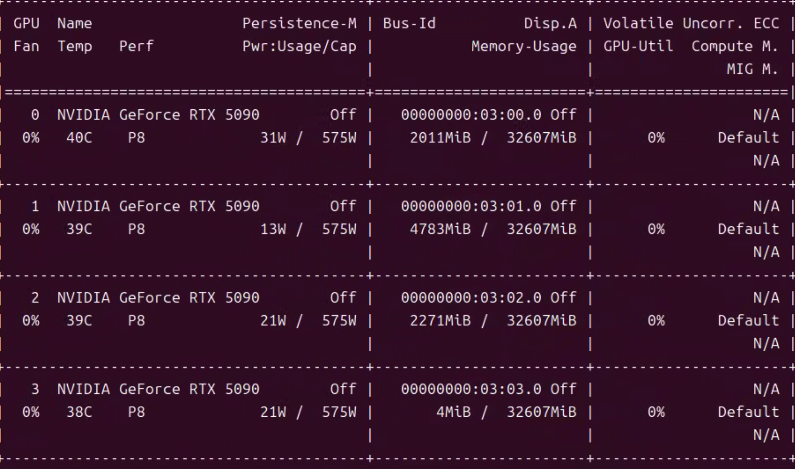
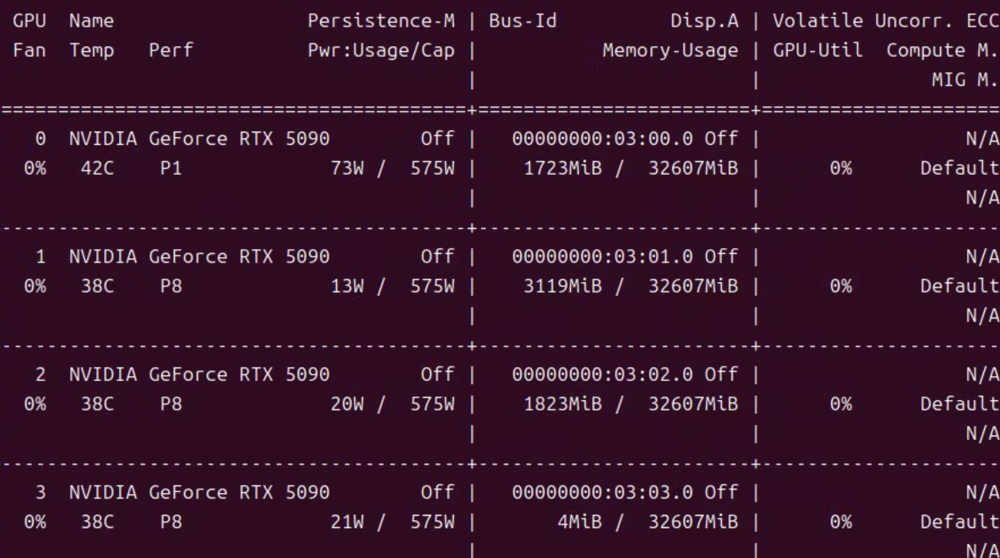
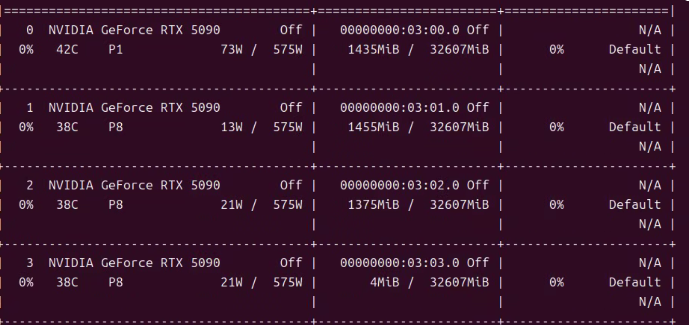

# ComfyUI 多实例部署配置教程

本文档介绍如何部署多个 ComfyUI 实例，实现环境隔离、多卡并行和高并发处理能力。

## 目录

- [架构概述](#架构概述)
- [服务器配置](#服务器配置)
- [FRP 内网穿透配置](#frp-内网穿透配置)
- [测试脚本](#测试脚本)
- [测试结果](#测试结果)

---

## 架构概述

### 多实例部署方案

本教程采用**方案二：多端口分发**，适用于以下场景：

- 多卡并行运行多个任务
- 提高服务并发处理能力
- 为不同实例配置独立的 HTTPS 和认证

```
                    ┌─────────────────────────────────────┐
                    │         FRP Client (frpc)           │
                    │  公网域名：comfyui[1-2].leng.xz   │
                    └──────────────┬──────────────────────┘
                                   │
          ┌────────────────────────┼────────────────────────┐
          │                        │                        │
          ▼                        ▼                        ▼
   ┌─────────────┐          ┌─────────────┐          ┌─────────────┐
   │  实例 0      │          │  实例 1      │          │  实例 2      │
   │  Port 18880 │          │  Port 18881 │          │  Port 18882 │
   │  GPU 0      │          │  GPU 0      │          │  GPU 0      │
   └─────────────┘          └─────────────┘          └─────────────┘
```

---

## 服务器配置

### 1. 环境准备

```bash
# 激活 Conda 环境
conda activate comfyui-312

# 进入项目目录
cd /mnt/data/project/
```

### 2. 复制 ComfyUI 实例目录

```bash
# 复制实例 1（排除 models 目录）
rsync -av --exclude='/models/' ./ComfyUI/ ./ComfyUI-instance-1/

# 如有需要，可继续复制更多实例
# rsync -av --exclude='/models/' ./ComfyUI/ ./ComfyUI-instance-2/
```

### 3. 配置模型共享（可选）

为避免重复下载模型文件，创建符号链接指向中央模型库：

```bash
# 实例 1
ln -s /mnt/data/project/ComfyUI/models /mnt/data/project/ComfyUI-instance-1/models

# 实例 2
ln -s /mnt/data/project/ComfyUI/models /mnt/data/project/ComfyUI-instance-2/models
```

### 4. 启动多个实例

```bash
# 终端 1：启动实例 0（端口 18880）
cd /mnt/data/project/ComfyUI && \
python main.py --listen 0.0.0.0 --port 18880 > /tmp/comfyui0.log 2>&1 &

# 终端 2：启动实例 1（端口 18881）
cd /mnt/data/project/ComfyUI-instance-1 && \
python main.py --listen 0.0.0.0 --port 18881 > /tmp/comfyui1.log 2>&1 &

# 查看进程
ps aux | grep python
```

### 5. 验证服务状态

```bash
# 检查实例 0
curl http://localhost:18880/system_stats

# 检查实例 1
curl http://localhost:18881/system_stats
```

---

## FRP 内网穿透配置

### 1. 编辑 FRP 配置文件

```bash
cd /mnt/data/project/frpc
vi data/frpc.toml
# 或在 Docker 中：/etc/frp/frpc.toml
```

### 2. 配置多个 HTTP 代理

```toml
serverAddr = "your-frp-server-ip"
serverPort = 7000

# 认证配置
auth.token = "your-frp-token"

# 实例 0 - test.leng.xz
[[proxies]]
name = "comfyui"
type = "http"
localPort = 18880
customDomains = ["test.leng.xz"]

# 实例 1 - test1.leng.xz
[[proxies]]
name = "comfyui1"
type = "http"
localPort = 18881
customDomains = ["test1.leng.xz"]

# 实例 2 - test2.leng.xz
[[proxies]]
name = "comfyui2"
type = "http"
localPort = 18882
customDomains = ["test2.leng.xz"]
```

### 3. 重启 FRP 服务

```bash
# Docker 方式
docker compose restart

# 或直接重启 frpc 服务
systemctl restart frpc
```

### 4. 验证外网访问

```bash
# 测试实例 0
curl http://test.leng.xz/system_stats

# 测试实例 1
curl http://test1.leng.xz/system_stats

# 测试实例 2
curl http://test2.leng.xz/system_stats
```

---

## 测试脚本

### 1. 安装依赖

```bash
cd D:\github\ComfyUI
pip install -r demo/requirements.txt
```

### 2. 配置 Token 认证

编辑测试脚本，设置服务器地址和 Token：

```python
# demo/text2img/test_api_with_token.py

# 实例 0 配置
SERVER = "test.leng.xz:80"
API_TOKEN = "your-token-here"

# demo/text2img/test_api_with_token1.py

# 实例 1 配置
SERVER = "test1.leng.xz:80"
API_TOKEN = "your-token-here"

# demo/text2img/test_api_with_token2.py

# 实例 2 配置
SERVER = "test2.leng.xz:80"
API_TOKEN = "your-token-here"
```

### 3. 运行测试

```bash
# 测试实例 0 - 文生图
python demo/text2img/test_api_with_token.py

# 测试实例 1 - 文生图
python demo/text2img/test_api_with_token1.py

# 测试实例 0 - 清理 GPU 内存
python demo/text2img/test_api_with_clear_mem.py

# 测试实例 1 - 清理 GPU 内存
python demo/text2img/test_api_with_clear_mem1.py
```

---

## 测试结果

### 1. 实例 0 生成图片

执行 `test_api_with_token.py` 使用实例 0 生成图片：


### 2. 实例 1 生成图片

执行 `test_api_with_token1.py` 使用实例 1 生成图片：


### 3. GPU 内存清理测试

#### 清理前 GPU 状态



#### 实例 0 清理后

执行 `test_api_with_clear_mem.py` 清理实例 0：



#### 实例 1 清理后

执行 `test_api_with_clear_mem1.py` 清理实例 1：



---

## 运行日志示例

```
============================================================
ComfyUI 多 GPU 文生图测试（带 Token 认证）
============================================================
检查 ComfyUI 服务...
✓ 认证通过，服务正常运行
  版本：0.16.4
  PyTorch: 2.10.0+cu128

  GPU 设备:
    [0] cuda:0 NVIDIA GeForce RTX 5090 : cudaMallocAsync
        VRAM: 30.4GB / 31.4GB

加载工作流：workflow_api.json
✓ 工作流配置:
  正面提示词：a beautiful landscape with mountains and lake
  负面提示词：text, watermark, blurry, low quality

  GPU 分配:
    CLIPTextEncode (节点 6): cuda:0
    CLIPTextEncode (节点 7): cuda:0
    KSampler (节点 8):       cuda:1
    VAEDecode (节点 9):      cuda:2

  生成参数:
    分辨率：512x512
    步数：20
    种子：123456

提交工作流...
✓ 已提交
  Prompt ID: 9ee32748-b215-4125-80cd-de6ded2cbb49
  Queue Number: 0

等待执行完成...
✓ 执行完成 (耗时：94.9s)

获取生成结果...
  状态：success

  图片 1: ComfyUI_multi_gpu_00008_.png
    ✓ 已保存：outputs/ComfyUI_multi_gpu_00008_.png
    大小：464.0 KB

============================================================
✓ 测试完成!
============================================================
```

---

## 常见问题

### 1. 连接失败

```
✗ 连接失败：HTTP 404
```

**解决方案：**

- 检查 ComfyUI 服务是否运行
- 确认 Token 配置正确
- 验证 FRP 隧道是否畅通

### 2. 端口冲突

```
Address already in use
```

**解决方案：**

- 使用不同端口启动实例
- 检查并关闭占用端口的进程

### 3. GPU 显存不足

```
RuntimeError: CUDA out of memory
```

**解决方案：**

- 运行清理脚本释放显存
- 减少并发实例数量
- 降低生成分辨率和步数

---

## 相关文档

- [ComfyUI API 文档](../ComfyUI_API_Documentation.md)
- [单节点指定 GPU 功能开发](../ComfyUI*单节点指定 GPU 功能开发*需求与设计方案.md)
- [MOVA GPU 显存管理](./MOVA_GPU_Design.md)
